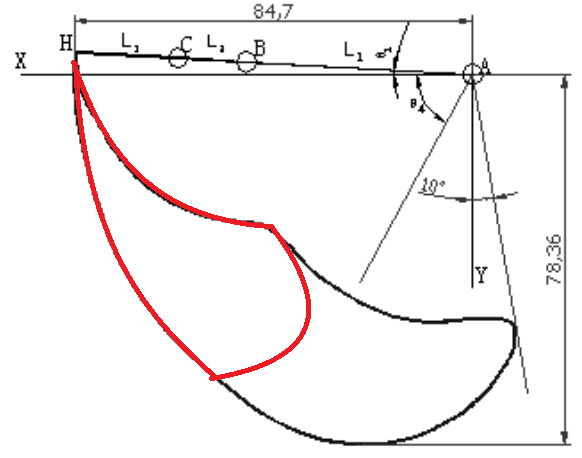

# KBD Evo (WIP)

### Searching effective keyboard layout using evolutionary algorithm

## Requirements

- [kle-py](https://github.com/DamSenViet/kle-py) and [kle-json](https://github.com/DamSenViet/kle-json) for loading the keyboard layout

    If `kle-json` did not autometicly install with `kle-py`, put the `kle-json` folder under `/kle-py/damsenviet/kle/` directory

## Data
The key press rate, flexibility, and effectiveness of each finger are taken from the following paper:
- [An Estimation of Finger-Tapping Rates and Load Capacities and the Effects of Various Factors](http://dx.doi.org/10.1177/0018720814563976)
- [Neuromuscular and biomechanical functions subserving finger dexterity in musicians](https://doi.org/10.1038%2Fs41598-019-48718-9)

## Hand Model

- Each finger is modeled with tapping rate using data from papers.
- R2 row is penalized more than R4 since it is harder to reach and has a narrower workspace.

|
-|-
[Figure 1: The ANSI keyboard layout with 5 rows](https://www.farah.cl/Keyboardery/Why-Do-Keycap-Sets-have-so-many-Copies-of-the-Backslash-Pipe-Key/)|[Figure 2: Workspace of a finger, red indicates the assumed workspace while typing](https://www.farah.cl/Keyboardery/Why-Do-Keycap-Sets-have-so-many-Copies-of-the-Backslash-Pipe-Key/)

- Middle columns assigned to the index finger is penelized
<!-->
- staggered keys are penalized based on the offset of the key and the hand orientation

|
-|-
[Figure 3: hand orientation](https://fitforworksg.com/typing-and-ergonomics-what-is-important/)|Figure 4: offset angle of staggered keys
<-->

## Cost Function
